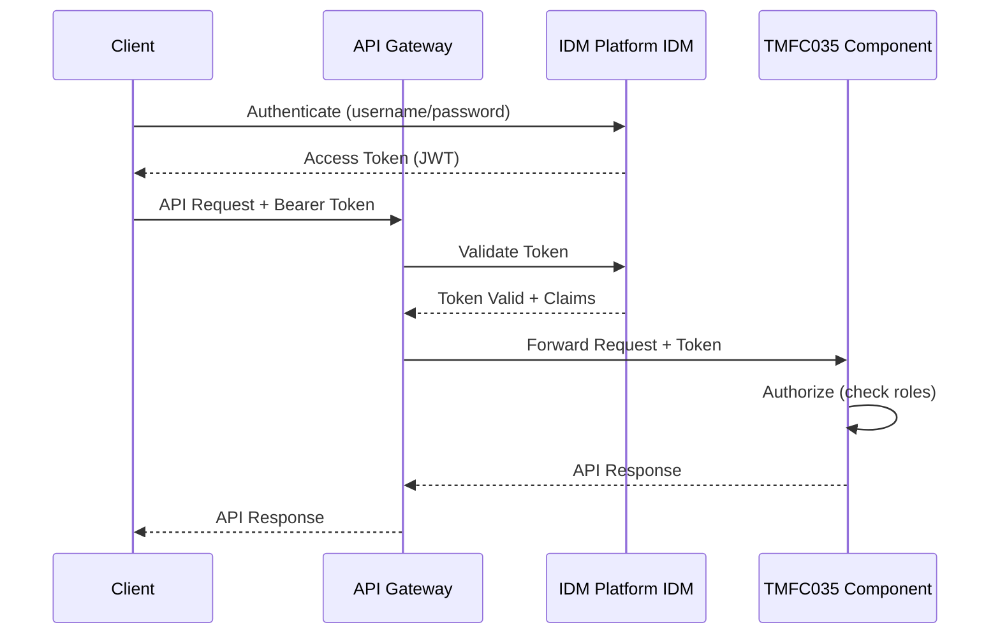

# Example MNO ODA Component Configurations

This directory contains Example MNO-specific configuration files for TM Forum ODA Canvas components deployed in the Example MNO environment.

## Overview

Example MNO's ODA implementation follows the reference architecture defined in this repository, with customizations for:

- **Identity Management**: Integration with Example MNO IDM Platform IDM
- **Event Bus**: Apache Kafka cluster for event-driven communication
- **Service Mesh**: Istio for secure service-to-service communication
- **API Gateway**: Kong Gateway for external API exposure
- **Monitoring**: Prometheus, Elasticsearch, and Jaeger integration
- **Data Residency**: Example Countryn data sovereignty compliance

## Components

### TMFC035 - Permissions Management

**Configuration File**: `tmfc035-values.yaml`

**Purpose**: Manages user roles and permissions for the Example MNO ODA Party Domain.

**Key Features**:
- OAuth2/OIDC integration with Example MNO IDM Platform realm
- TMF672 (User Role Permission) and TMF669 (Party Role) APIs
- Event publishing to Kafka topics for role/permission changes
- Integration with existing TMF632 Party Management component

**Deployment**:
```bash
# Deploy using Helm with Example MNO values
helm install example-mno-permissions-mgmt oda-canvas/tmfc035 \
  -f components/example-mno/tmfc035-values.yaml \
  --namespace example-mno-oda-party
```

**Key Integrations**:
- Depends on: TMF632 Party Management (existing Example MNO deployment)
- Exposes: TMF672 User Role Permission, TMF669 Party Role
- Events: Publishes to `example-mno.oda.party.userRole` and `example-mno.oda.party.partyRole` topics
- IDM: Syncs roles with IDM Platform realm `oda` at `idm.example-mno.com.my`

## Environment Configuration

### Secrets Management

All sensitive values are managed via Kubernetes secrets and referenced using environment variable substitution:

- `UMOBILE_TMFC035_CLIENT_SECRET`: OAuth2 client secret for TMFC035 component
- `UMOBILE_KAFKA_PASSWORD`: Kafka SASL authentication password

**Example Secret Creation**:
```bash
kubectl create secret generic example-mno-tmfc035-secrets \
  --from-literal=oauth-client-secret='xxx' \
  --from-literal=kafka-password='xxx' \
  -n example-mno-oda-party
```

### Network Access

**Internal Endpoints**:
- TMF672 API: `http://example-mno-permissions-management.example-mno-oda-party.svc.cluster.local:8080`
- TMF669 API: `http://example-mno-permissions-management.example-mno-oda-party.svc.cluster.local:8080`
- Metrics: `http://example-mno-permissions-management.example-mno-oda-party.svc.cluster.local:4000`

**External Access** (via API Gateway):
- TMF672: `https://api.example-mno.com.my/oda/userRolePermission/v4`
- TMF669: `https://api.example-mno.com.my/oda/partyRoleManagement/v4`

## Security Architecture

### Zero Trust Model

All component-to-component communication requires:
1. **mTLS**: Enforced by Istio service mesh
2. **JWT Token**: OAuth2 access token from Example MNO IDM Platform
3. **RBAC**: Kubernetes role-based access control

### Role Mappings

ODA Canvas roles are mapped to Example MNO IAM roles:

| ODA Role | Example MNO Role | Permissions |
|----------|--------------|-------------|
| PartyManager | party_admin | Full CRUD on parties, roles, permissions |
| PermissionViewer | party_readonly | Read-only access to roles and permissions |
| RoleManager | role_manager | Create/update/delete roles and permissions |

### OAuth2 Flow



## Event-Driven Architecture

### Published Events

TMFC035 publishes the following events to Kafka:

**Topic: `example-mno.oda.party.userRole`**
- `userRoleCreateEvent`
- `userRoleAttributeValueChangeEvent`
- `userRoleStateChangeEvent`
- `userRoleDeleteEvent`
- `permissionCreateEvent`
- `permissionAttributeValueChangeEvent`
- `permissionStateChangeEvent`
- `permissionDeleteEvent`

**Topic: `example-mno.oda.party.partyRole`**
- `PartyRoleCreateEvent`
- `PartyRoleAttributeValueChangeEvent`
- `PartyRoleStateChangeEvent`
- `PartyRoleDeleteEvent`

### Subscribed Events

TMFC035 subscribes to events from:

**Topic: `example-mno.oda.party.management`** (from TMF632 Party Management)
- Individual and organization lifecycle events

**Topic: `example-mno.oda.process.flow`** (from TMF701 Process Flow - optional)
- Process and task flow events

## Monitoring & Observability

### Metrics

Prometheus metrics available at `/metrics`:
- API request rates and latencies (TMF672, TMF669)
- Event publishing/consumption metrics
- OAuth2 token validation metrics
- Database connection pool metrics

### Logging

All logs are JSON-formatted and shipped to Elasticsearch:
- **Index Pattern**: `example-mno-oda-permissions-*`
- **Retention**: 90 days
- **Log Levels**: DEBUG, INFO, WARN, ERROR

### Tracing

Distributed tracing via Jaeger:
- **Sampling Rate**: 10% of requests
- **UI**: `https://tracing.example-mno.internal`

## High Availability

- **Replicas**: 3 pods across different availability zones
- **Pod Disruption Budget**: Minimum 2 pods available during updates
- **Affinity**: Prefer spreading across different nodes
- **Auto-scaling**: HPA based on CPU (target: 70%) and memory (target: 80%)

## Compliance

Example MNO's ODA deployment complies with Example Countryn cybersecurity and data protection regulations through a layered approach:

**Regulatory Framework**:
- **Cyber Security Act 2024**: Risk management, incident reporting, CISO requirements, audits
- **Personal Data Protection Act (PDPA) 2024**: Security, consent, retention, breach notification, access rights
- **AI Governance and Ethics (AIGE) Framework**: Accountability, transparency, fairness, safety, privacy, human oversight

**Compliance Model**:
```
Example Countryn Legal Requirements → NIST CSF 2.0 → ODA Implementation
```

**Detailed Mapping**: See `../../docs/compliance/malaysia/REGULATORY-COMPLIANCE.md` for comprehensive mapping of:
- Cyber Security Act 2024 requirements to NIST CSF 2.0 controls
- PDPA 2024 principles to data protection controls
- AIGE framework pillars to AI system governance

### Data Residency
All data processing occurs within Example Countryn data centers to comply with local data sovereignty requirements.

### GDPR Compliance
- Audit logging enabled for all permission changes
- Support for data subject access requests (DSAR)
- Role and permission data retention policies

### NIST Cybersecurity Framework 2.0 Compliance

Example MNO's TMFC035 deployment implements NIST CSF 2.0 controls across all six core functions:

#### GOVERN (GV)
- **GV.RM-02**: TMF672 API manages roles and responsibilities with clear accountability
- **GV.OV-01**: Identity Operator provides centralized IAM oversight
- **Risk Management**: Zero Trust Architecture with least privilege access

#### IDENTIFY (ID)
- **ID.AM-01**: Component metadata tracks inventory (version 1.1.1, TMFC035)
- **ID.RA-01**: Container scanning (Trivy) identifies vulnerabilities
- **Asset Management**: Kubernetes CR provides single source of truth

#### PROTECT (PR)
- **PR.AA-01**: IDM Platform IDM manages all identities and credentials
- **PR.AA-03**: OAuth2/OIDC authentication for all users
- **PR.AA-04**: JWT tokens protected with RSA-256 signatures
- **PR.AA-05**: RBAC via role mappings (party_admin, role_manager, party_readonly)
- **PR.AA-06**: Full identity lifecycle (bootstrap, dynamic roles, deprovisioning)
- **PR.DS-01**: Encryption at rest for all persistent data
- **PR.DS-02**: TLS 1.3 for external traffic, mTLS (Istio STRICT) for internal
- **PR.IR-02**: 3 replicas, PDB (minAvailable: 2), multi-zone deployment

#### DETECT (DE)
- **DE.CM-01**: Network monitoring via Istio service mesh telemetry
- **DE.CM-09**: Comprehensive monitoring stack:
  - Prometheus metrics on port 4000 (scrape interval: 30s)
  - Elasticsearch centralized logging (JSON format)
  - Jaeger distributed tracing (10% sampling)
- **DE.AE-03**: Event correlation via Kafka (example-mno.oda.party.* topics)

#### RESPOND (RS)
- **RS.MA**: Incident response via ODA platform team
- **RS.MI-02**: Automated remediation:
  - Kubernetes health checks for pod restart
  - Circuit breakers prevent cascade failures
  - Rate limiting (100 req/s) blocks API abuse
- **Evidence Preservation**: Immutable logs in Elasticsearch (90-day retention)

#### RECOVER (RC)
- **RC.RP-01**: Automated backup and restore procedures
- **RC.RP-02**: Defined recovery objectives:
  - RTO: 1 hour for critical TMFC035 APIs
  - RPO: 5 minutes (database replication)
- **Backup Strategy**: Daily backups at 2 AM MYT, 30-day retention, S3 encrypted storage

**Gap Mitigation**:
- **Security Automation**: Implement SOAR for automated incident response
- **Advanced Threat Detection**: Deploy UEBA for behavioral analytics
- **Supply Chain Security**: Automated SBOM generation and vulnerability tracking

**Compliance Evidence**:
- Audit logs: Elasticsearch index `example-mno-oda-permissions-*`
- Metrics: Prometheus at `https://prometheus.example-mno.internal`
- Security events: SIEM integration for real-time monitoring

**Reference**: See `../../docs/SECURITY-NIST-CSF-MAPPING.md` for comprehensive NIST CSF 2.0 framework alignment.

## Support & Troubleshooting

### Common Issues

**Issue**: OAuth2 token validation failures
```bash
# Check IDM connectivity
kubectl exec -it deployment/example-mno-permissions-management -n example-mno-oda-party -- \
  curl -v https://idm.example-mno.com.my/auth/realms/oda/.well-known/openid-configuration

# Check client secret
kubectl get secret example-mno-tmfc035-secrets -n example-mno-oda-party -o json | jq '.data["oauth-client-secret"]' -r | base64 -d
```

**Issue**: Event publishing failures
```bash
# Check Kafka connectivity
kubectl exec -it deployment/example-mno-permissions-management -n example-mno-oda-party -- \
  kafka-console-producer --broker-list kafka-1.example-mno.internal:9092 --topic test

# Check consumer lag
kubectl exec -it kafka-0 -n kafka -- \
  kafka-consumer-groups --bootstrap-server localhost:9092 --group example-mno-permissions-consumer --describe
```

### Contact

- **ODA Platform Team**: oda-platform@example-mno.com.my
- **Party Domain Team**: party-domain@example-mno.com.my
- **Slack Channel**: #example-mno-oda-support
